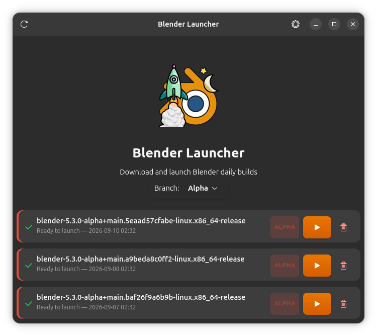
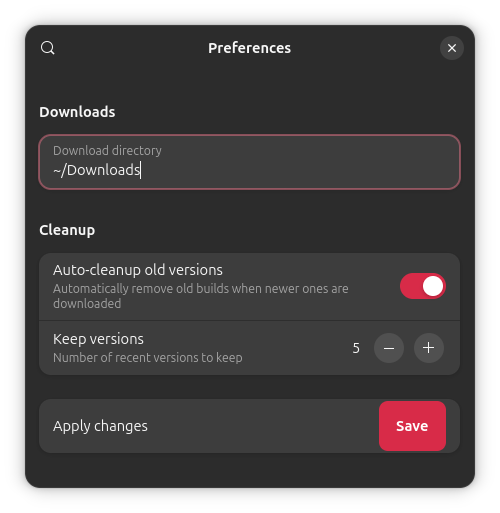

# Blender Launcher

A modern GTK4 and Libadwaita application for downloading, extracting, and launching Blender daily builds.

<p align="center"></p>



## Features

- **Daily Build Scraping:** Automatically fetches the latest daily builds from `builder.blender.org`.
- **Release Date Tracking:** Displays release dates and sorts versions chronologically so the latest is always at the top.
- **Branch Filter:** Narrow the list to a single branch (stable, beta, alpha, ...); branches are discovered from the builds page and color-coded in the list.
- **Download Management:** Supports downloading archives with progress bars and ETA estimation.
- **Automatic Extraction:** Handles `.tar.xz` archives and extracts them to a configurable directory.
- **Smart Cleanup:** Automatically cleans up old versions based on a user-defined keep count.
- **Native Experience:** Built with GTK4 and Libadwaita for a consistent GNOME look and feel.
- **Persistent Metadata:** Stores release dates in `.date` files to ensure sorting remains correct even after restarts or local changes.

## Installation

### Prerequisites

Ensure you have the following system dependencies installed:

- Python 3.11+
- GTK4
- Libadwaita
- `tar` (for extraction)
- GObject Introspection development files, needed to build PyGObject during `uv sync`
  (`libgirepository-2.0-dev` on Debian/Ubuntu, `gobject-introspection-devel` on Fedora)

### Running, from source, with `uv` (Recommended)

This will run **blenderlauncher** without installing anything, right from the cloned source tree (this repo).

First, clone the repo and `cd` to it:

```bash
git clone https://github.com/un1tz3r0/blenderlauncher
cd blenderlauncher
```

Then make sure your virtual environment is setup and launch the program:

```bash
uv sync
uv run blenderlauncher-gui
```

### Installing on desktop linux distros

Use `scripts/install-desktop.sh`, it will install the python sources, icons and a `.desktop` file so that the program appears in your desktop environment's applications menu.

```bash
bash scripts/install-desktop.sh
```

### Manual Installation

```bash
pip install .
```

### Flatpak

You can build a flatpak package that can be installed with `flatpak install` using the `scripts/build-flatpak.sh` script.

```bash
bash scripts/build-flatpak.sh
```

## Usage

### GUI

Launch the graphical interface to manage your Blender builds:

```bash
blenderlauncher-gui
```

### CLI

A command-line front-end is also available for quick updates and launches. It
shares the scraping, download, extraction and cleanup code — and the settings
file — with the GUI:

```bash
blenderlauncher-cli              # download (if needed) and launch the newest build
blenderlauncher-cli --show       # numbered list of remote + local builds
blenderlauncher-cli --last 1     # skip the newest build, e.g. when it is broken
blenderlauncher-cli --no-run     # just print the path of the blender executable
blenderlauncher-cli --cleanup --keep 3
```

The platform whose builds are considered is detected from the system you are
running on; override it with `--os linux|macos|windows` (extraction and launch
currently only support the Linux `.tar.xz` builds) or by setting `filter_os` in
`~/.config/blenderlauncher/settings.json`. Run `blenderlauncher-cli --help` for
the full list of options.

From a source checkout without installing, use
`uv run python -m blenderlauncher.cli` (or `PYTHONPATH=src python3 -m blenderlauncher.cli`).

## Configuration

Preferences can be adjusted within the GUI, including:
- Download directory
- Auto-cleanup toggle
- Number of versions to keep



The branch selection and platform override are stored alongside these in
`~/.config/blenderlauncher/settings.json`.

## License

This project is licensed under the terms of the MIT license (or whichever license is specified in the project).
